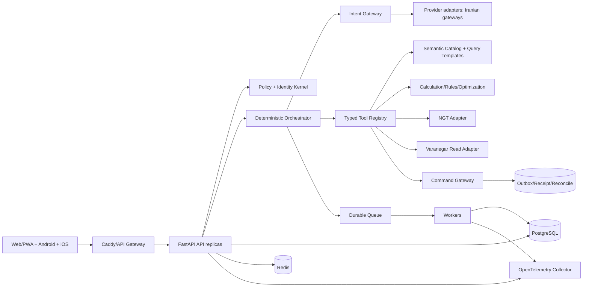

# نقشه‌راه NeginAI Enterprise برای حداقل ۲۰۰ کاربر همزمان

## تصمیم معماری

نسخه هدف یک **مونولیت ماژولار با workerهای جدا و قراردادهای دامنه‌ای** است؛ نه بازنویسی یکباره و نه microservice‌سازی زودهنگام. سه اصل غیرقابل مذاکره:

1. مدل زبانی فقط `IntentEnvelope` ساختاریافته و در پایان متن فارسی را تولید می‌کند.
2. محاسبه، SQL، policy، مجوز، تصمیم، workflow، retry، verification و audit داخل NeginAI است.
3. هیچ provider، مدل یا command بدون معیار قبولی و امکان خاموش‌شدن fail-closed وارد تولید نمی‌شود.

## معماری هدف



## مرز دقیق مدل

### ورودی مدل

فقط متن کمینه‌شده کاربر، زبان/locale، فهرست intentهای مجاز و JSON Schema. داده خام فروش، رمز، SQL، شناسه حساس و کل history به provider ارسال نشود مگر یک policy صریح و ثبت‌شده اجازه دهد.

### خروجی مدل

```json
{
  "intent": "customer_sales_summary",
  "entities": {"customer_id": "..."},
  "time_range": {"kind": "current_month"},
  "requested_metrics": ["net_sales"],
  "confidence": 0.92,
  "needs_clarification": false
}
```

مدل اجازه ندارد SQL، نام جدول، permission، مبلغ نهایی، approval یا command عملیاتی بسازد. Schema validation، allowlist و policy engine هر خروجی نامعتبر را رد می‌کنند.

### هوش داخل برنامه

| نیاز | سازوکار داخلی پیشنهادی | وابستگی به LLM |
|---|---|---|
| فهم تاریخ فارسی | parser قاعده‌ای + تقویم و timezone تست‌شده | فقط fallback کم‌اعتماد |
| نگاشت موجودیت | entity catalog، normalization، fuzzy search کنترل‌شده | انتخاب نهایی ممنوع بدون ID قطعی |
| گزارش | query template و semantic metrics نسخه‌دار | فقط intent و بیان نهایی |
| قیمت/مالیات/تخفیف | موتور رسمی NGT/Varanegar و verifier | صفر |
| پیشنهاد فروش | feature engineering، rule engine، ranking قابل توضیح | توضیح متن اختیاری |
| پیش‌بینی | مدل آماری/ML داخلی با backtest و drift monitor | صفر |
| مسیر | graph/VRP و OR-Tools با constraints کسب‌وکار | صفر |
| agent workflow | state machine، typed commands و compensation | فقط intent/summarization |
| دانش | PostgreSQL FTS/BM25 و metadata filters؛ embedding فقط پس از توجیه | تولید پاسخ محدود |

## پلتفرم ۲۰۰ کاربر همزمان

### data plane

- PostgreSQL نسخه پشتیبانی‌شده برای state تراکنشی، migration نسخه‌دار و Row-Level Security دفاع در عمق.
- Redis برای cache کوتاه‌عمر، distributed lock محدود، rate limit و idempotency cache؛ Redis منبع حقیقت نباشد.
- SQL Server/NGT همچنان system of record؛ NeginAI با read model و command adapter رسمی متصل شود.
- Outbox/inbox برای هر command؛ وضعیت‌های `prepared/sent/accepted/replicated/reconciled/failed_manual` و رسید immutable.

### compute plane

- API replicaهای stateless پشت Caddy؛ تعداد worker از load test و CPU/IO تعیین شود، نه عدد ثابت.
- scheduler فقط یک leader یا سرویس جدا؛ jobها در queue durable و workerها با timeout، retry budget و dead-letter.
- connection pool مستقل برای PostgreSQL و bulkhead جدا برای SQL Server، NGT و LLM.
- circuit breaker و degraded mode: گزارش cached/readonly مجاز؛ command یا پاسخ بدون شاهد fail-closed.

### کنترل ظرفیت

هدف ۲۰۰ concurrent user به‌معنای ۲۰۰ درخواست LLM همزمان نیست. درخواست‌ها به سه کلاس تقسیم شوند:

| کلاس | نمونه | بودجه |
|---|---|---|
| A سریع deterministic | navigation، profile، cached catalog | p95 پیشنهادی ≤ ۵۰۰ms |
| B داده‌ای | گزارش SQL/محاسبه | p95 پیشنهادی ≤ ۲s با timeout/bulkhead |
| C مدل‌یار | intent یا تدوین متن | صف محدود، deadline و fallback deterministic؛ p95 پیشنهادی ≤ ۸s |

این اعداد **SLO پیشنهادی** هستند و فقط پس از baseline سخت‌افزار تایید می‌شوند. معیار آزمون پذیرش:

- ۲۰۰ virtual user همزمان، ramp کنترل‌شده و soak حداقل ۳۰ دقیقه در محیط staging.
- نرخ خطای اپلیکیشن کمتر از ۱٪؛ صفر lost/duplicate command.
- p95 هر کلاس داخل SLO و p99 ثبت‌شده؛ queue depth پایدار و connection pool اشباع نشود.
- fault injection برای قطع NGT/SQL/LLM، timeout، retry و unknown-commit.
- recovery و reconcile همه commandهای نیمه‌تمام قبل از فعال‌سازی مجدد mutation.

## سیاست provider ایرانی و هزینه

ارائه‌دهندگان بررسی‌شده «درگاه ایرانی به مدل‌های جهانی» هستند، نه لزوماً مدل بومی ایرانی. انتخاب تولید فقط با benchmark داخلی انجام شود.

### shortlist برای benchmark، نه انتخاب نهایی

| درگاه | شاهد عمومی فعلی | ریسک/سوال باز |
|---|---|---|
| AvalAI | API سازگار OpenAI/Responses، راهنمای structured output/tool و status page | SLA قراردادی، نگه‌داری داده، rate limit و قیمت مدل منتخب باید کتبی تایید شود |
| Liara AI | plan با ۱۰ یا ۱۰۰ درخواست بر ثانیه، monitoring و کلید تیمی | هزینه اشتراک + توکن؛ retention لاگ ۳۰/۶۰ روز نیازمند بررسی حریم خصوصی است |
| Netarz | OpenAI-compatible، function calling/JSON، کلید با IP/model/budget، مدل رایگان تا ۱۰۰ درخواست روزانه | default حدود ۶۰ RPM و چند concurrent برای تولید ۲۰۰ کاربر کافی نیست مگر افزایش رسمی |
| Darvareh | OpenAI-compatible، pay-as-you-go، cost limit و ادعای failover/SLA 99.9٪ | SLA و DPA باید سند قراردادی شوند؛ عدد سایت به‌تنهایی proof تولید نیست |

### benchmark اجباری

مجموعه حداقل ۳۰۰ درخواست فارسی واقعیِ پاک‌سازی‌شده در intentهای فروش، مالی، مسیر، انبار و ambiguity:

- صحت JSON Schema و intent/entity/time: وزن ۳۵٪
- false-command و hallucination: وزن ۲۵٪؛ هر اقدام ناامن = رد فوری
- p95 latency و timeout: وزن ۱۵٪
- availability در ۷ روز و rate-limit behavior: وزن ۱۰٪
- هزینه به‌ازای درخواست موفق: وزن ۱۰٪
- privacy/DPA/log-retention/key controls: وزن ۵٪ و gate اجباری

قیمت تنها بین provider/modelهای عبورکرده مقایسه شود. فرمول:

`هزینه موفق = (توکن ورودی × نرخ ورودی) + (توکن خروجی × نرخ خروجی) + retry + اشتراک سرشکن`

مدل رایگان فقط برای توسعه و canary بدون داده حساس است؛ سقف ۱۰۰ درخواست روزانه نمونه‌ای از محدودیت نامناسب برای تولید ۲۰۰ کاربر است.

## نقشه‌راه مرحله‌ای

### فاز ۰ — تثبیت baseline و توقف drift (۱ تا ۲ هفته)

- سه شکست محصولی تست را اصلاح و suite را سبز کنید.
- port/deployment contract واحد و versioned بسازید؛ launcher قدیمی را deprecate کنید.
- lockfile، CI، migration policy، secret inventory بدون افشای مقدار، SBOM و backup/restore runbook.
- artifact referenceها را از مسیر مطلق به URI منطقی مهاجرت دهید.

**Gate:** تست محصول ۱۰۰٪ سبز، build تکرارپذیر، restore آزمایش‌شده و هیچ مسیر G اجباری در artifact جاری.

### فاز ۱ — بستر Enterprise (۲ تا ۴ هفته)

- PostgreSQL + migration و انتقال shadow از SQLite؛ dual-read compare، سپس cutover قابل rollback.
- Redis/rate-limit/idempotency و queue durable؛ scheduler/worker خارج از API.
- OpenTelemetry traces/metrics/log correlation و dashboard SLO.
- identity lifecycle و RBAC/ABAC نسخه‌دار؛ RLS برای دامنه‌های حساس.

**Gate:** migration rehearsal، zero-diff مقادیر کلیدی، failover، multi-worker و ۲۰۰-user read-only load test.

### فاز ۲ — vertical slice رسمی سفارش (۳ تا ۵ هفته)

- Tour → CustomerCall → policy snapshot → draft → server reprice → savedata → receipt → Replicate → crosswalk → reconcile.
- outbox/inbox، actor و policy version در هر مرحله؛ prize/split/merge و unknown commit.
- هیچ bridge جایگزین NGT بدون تصمیم رسمی مالک محصول نشود.

**Gate:** golden cases مالک، fault injection، no duplicate/lost order و reconciliation کامل در staging.

### فاز ۳ — هسته هوشمندی داخلی و AI Gateway (۳ تا ۵ هفته)

- `IntentEnvelope`, provider adapters، schema validation، redaction، budget، timeout و circuit breaker.
- semantic metric registry، typed query templates، deterministic planner و evidence pack/verifier.
- benchmark چهار درگاه و چند مدل ارزان؛ انتخاب cheapest-passing با قرارداد fallback.
- suite رگرسیون فارسی و prompt-injection/tool-abuse.

**Gate:** ۳۰۰-case benchmark، false-command صفر، پاسخ بدون evidence fail-closed و هزینه اندازه‌گیری‌شده.

### فاز ۴ — محصول و امنیت سازمانی (۳ تا ۴ هفته)

- مهاجرت تدریجی UI به React/TypeScript/Vite با حفظ PWA؛ ابتدا shell و design system، سپس screenها.
- CSP، dependency scanning، ASVS-based verification، secure upload، retention و audit export.
- Android/iOS contract tests، device farm یا ماتریس دستگاه واقعی، offline outbox و conflict UX.

**Gate:** accessibility، browser/device matrix، security scan بدون finding تاییدشده بحرانی/بالا و UAT نقش‌ها.

### فاز ۵ — ظرفیت، DR و rollout (۲ تا ۳ هفته)

- load/soak/fault test، backup restore، RPO/RTO drill، runbook و on-call alerts.
- pilot محدود، canary، rollback خودکار و feature flags.
- پس از reconcile کامل pilot، افزایش کاربران مرحله‌ای تا ۲۰۰ concurrent.

**Gate:** SLO، recovery و financial/operational reconciliation با امضای مالک کسب‌وکار.

## برآورد

برآورد برنامه‌ریزی، نه تعهد: حدود **۱۴ تا ۲۳ هفته به‌صورت ترتیبی**؛ با تیم چندتخصصی و اجرای موازی کنترل‌شده می‌تواند کوتاه‌تر شود، اما فاز ۲ و gateهای عملیاتی قابل حذف نیستند.

## معیار Done نسخه Enterprise

- همه تست‌های محصول و security/contract سبز؛ artifactهای تاریخی drift-free.
- ۲۰۰ concurrent user در staging با SLO و fault test اثبات‌شده.
- PostgreSQL/queue/worker/observability و backup/restore عملیاتی.
- هیچ محاسبه یا command حیاتی وابسته به داوری آزاد LLM نیست.
- provider ایرانی cheapest-passing با DPA/SLA/rate limit و fallback آزموده‌شده.
- چرخه NGT/Varanegar دارای receipt، idempotency، crosswalk و reconcile است.
- rollout/rollback و پاسخ حادثه تمرین شده است.

## منابع رسمی به‌روز

- SQLite WAL: https://www.sqlite.org/wal.html
- FastAPI server workers: https://fastapi.tiangolo.com/deployment/server-workers/
- PostgreSQL MVCC: https://www.postgresql.org/docs/current/mvcc-intro.html
- PostgreSQL Row Security: https://www.postgresql.org/docs/current/ddl-rowsecurity.html
- OpenTelemetry Python: https://opentelemetry.io/docs/languages/python/instrumentation/
- OWASP ASVS: https://owasp.org/www-project-application-security-verification-standard/
- AvalAI docs/pricing: https://docs.avalai.ir/ و https://avalai.ir/pricing/
- Liara AI: https://liara.ir/products/ai/
- Netarz AI API: https://netarz.ir/ai-api
- Darvareh: https://darvareh.ir/
