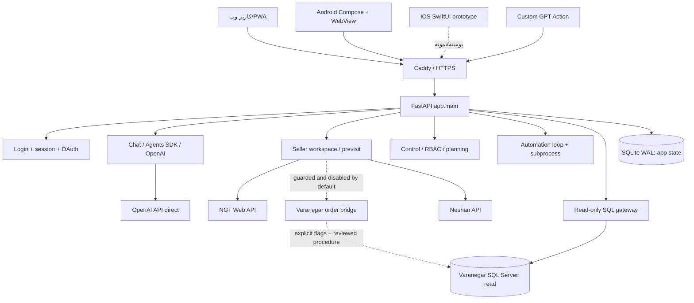

# نقشهٔ تفصیلی پروژه NeginAI — ۱۴۰۵/۰۶/۱۱

## وضعیت و دامنه

- **نسخه بررسی‌شده:** شاخه `dev/hamed`، بازبینی `673112f6ce5bb1f8dfaca41804cbd893b57bfc6c`
- **ریشهٔ قابل تغییر:** `D:\Projects\NeginAI`
- **مرجع رئیس:** `\\192.168.1.184\NeginAI` فقط خواندنی و خارج از این گزارش
- **حکم فعلی:** نمونهٔ مهندسی‌شده و غنی از شواهد است، اما برای ۲۰۰ کاربر همزمان و عملیات سازمانی **NO-GO** است.
- **محدودیت ممیزی:** هیچ اتصال زنده، ارسال NGT، Replicate، ثبت Varanegar، تغییر سرویس یا آزمون بار روی محیط عملیاتی انجام نشد.

## نمای کلان فعلی

## موجودی اثبات‌شده

| بخش | اندازه/وضعیت | نقش واقعی |
|---|---:|---|
| فایل‌های Git | ۱٬۸۹۲ | نسخه محلی دارای Git مستقل و بدون remote |
| `app/` | ۸۵ فایل | FastAPI، سرویس‌های دامنه، SQL guard، احراز هویت، UI static |
| routeهای FastAPI | ۱۱۰ عملیات route | چت، داده، برنامه‌ریزی، کنترل، فروشنده، صوت، فایل، OAuth، Push و Android |
| routerهای متصل | ۱۹ | همگی در یک process/application مونولیت فعلی |
| جداول SQLite | حداقل ۴۳ جدول | هویت، چت، کنترل، برنامه‌ریزی، پیش‌ویزیت، اتوماسیون و انبار |
| `tests/` | ۵۰۷ فایل Python + ۳ فایل JS | ۲۵۰۲ تست Python جمع‌آوری شد؛ ۳ تست JS نیز مستقل اجرا شد |
| `scripts/` | ۸۰۰ فایل | عمدتاً استخراج و بازسازی شواهد Varanegar/NGT و عملیات Windows |
| `docs/` | ۴۲۲ فایل | قراردادها، شواهد بازسازی و گزارش‌های قبلی |
| Android | ۲۸ فایل | Compose + WebView، GPS، میکروفون، دانلود و چاپ |
| iOS | ۱۰ فایل | نمونه SwiftUI، نه محصول هم‌سطح Android |

## لایه‌های کد و مسئولیت

### ۱. ارائه و کلاینت

- `app/static/assistant.html`, `assistant.js`, `assistant.css`: رابط فارسی RTL و PWA فعلی؛ JavaScript بزرگ و متمرکز.
- `android/SellerNavigator`: پوستهٔ بومی Android و WebView برای مسیر روز، GPS، صدا، فایل و چاپ.
- `ios/SellerNavigator`: نمونهٔ SwiftUI؛ شواهد برابری قابلیت و تست دستگاه واقعی کامل نیست.
- `Caddyfile`: TLS و reverse proxy دامنه عمومی؛ مسیر `/erp/*` به ۸۱۰۰ و برنامه به ۸۰۰۶.

### ۲. API و هویت

- `app/main.py`: lifespan، loop همگام‌سازی metadata، loop اتوماسیون و اتصال ۱۹ router.
- `app/routes/auth.py`: login/session cookie، محدودکنندهٔ تلاش در حافظه همان process.
- `app/oauth_service.py` و `app/routes/oauth.py`: authorization code + PKCE و access/refresh token ذخیره‌شده به‌صورت hash.
- `app/access_control.py` و `app/control_service.py`: نقش/مجوز، محدودهٔ شعبه و خط فروش، ثبت رسید عملیات کنترلی.

### ۳. هستهٔ داده و گزارش

- `app/sql_guard.py`: parse با `sqlglot`، فقط یک `SELECT` یا `WITH ... SELECT` و ممنوعیت عملیات تغییردهنده.
- `app/chat_service.py`: ابزارهای عامل، انتخاب مدل، اجرای گزارش و تدوین پاسخ؛ اکنون وابستگی مستقیم و عمیق به OpenAI/Agents SDK دارد.
- `app/schema_catalog.py`, `schema_service.py`, `entity_service.py`: کاتالوگ schema، ترجمه و entity catalog.
- `app/reasoning_context.py`: حل deterministic بخشی از زمان/زمینه مکالمه.
- `app/reporting_policy.py`: سیاست گزارش و دامنهٔ موضوع.

### ۴. عملیات فروشنده و پیش‌ویزیت

- `app/seller_workspace_service.py`: مسیرها، مشتری، وضعیت مالی و فضای کاری فروشنده.
- `app/previsit_service.py`: visit، draft، saved request و وضعیت محلی.
- `app/ngt_previsit_service.py`: کاتالوگ، policy، پیش‌نمایش رسمی، موجودی و اعتبار از NGT.
- `app/varanegar_order_bridge.py`: مسیر آزمایشی ثبت با idempotency و سه پرچم ایمنی؛ خاموش به‌صورت پیش‌فرض.

### ۵. قابلیت‌های اداری

- `app/planning_service.py`: سناریو، مقدار، مقایسه و audit برنامه‌ریزی.
- `app/automation_service.py`: زمان‌بندی محلی، اجرای report در subprocess و اعلان Push.
- `app/warehouse_assistant_service.py`: ورود snapshot انبار و پیشنهاد deterministic سفارش تامین‌کننده.
- `app/organization_structure_service.py`: قواعد ساختار سازمانی و گردش تایید پیشنهاد تغییر.

## مرزهای اعتماد فعلی

| مرز | ورودی | کنترل فعلی | شکاف Enterprise |
|---|---|---|---|
| اینترنت → Caddy | HTTP عمومی | TLS، HSTS، nosniff | CSP، WAF/rate limit سراسری و تست تنظیمات انتشار اثبات نشده |
| Caddy → FastAPI | proxy محلی | bind روی loopback در script جدید | portها و launcherها با هم ناسازگارند؛ topology نسخه‌دار نیست |
| مرورگر → API | cookie/API key/OAuth | cookie HttpOnly/SameSite، PKCE، RBAC | rate limit و session state میان چند worker مشترک نیست |
| FastAPI → SQLite | عملیات محلی | WAL، busy timeout، transaction | فقط یک writer همزمان؛ startup موازی یک تست شکست‌خورده دارد |
| Agent → SQL | SQL پیشنهادی مدل | parser، one-statement، row cap، access rewrite | مدل هنوز در تولید SQL نقش مرکزی دارد؛ طرح هدف باید query catalog/typed tools باشد |
| NeginAI → NGT | token/API contract | timeout/validation در serviceها | چرخه قطعی receipt/retry/reconcile کامل نیست |
| NeginAI → Varanegar | procedure محدود | flags، idempotency، validation | مسیر رسمی نهایی، prize، numbering و rollback عملیاتی تایید نشده |
| NeginAI → LLM | متن/شواهد | کلید سرور، tool guards | provider abstraction، data minimization، budget و failover مستقل وجود ندارد |

## نقشهٔ داده و مالکیت پیشنهادی

| داده | مالک فعلی | مالک هدف | قاعده |
|---|---|---|---|
| فروش/مشتری/موجودی رسمی | Varanegar/NGT | همان سامانه مبدأ | NeginAI فقط read model یا command رسمی |
| visit و outbox و receipt | SQLite | PostgreSQL NeginAI | هر command با actor، policy version، idempotency و reconciliation |
| کاربران و مجوزها | SQLite | IdP + PostgreSQL | RBAC/ABAC و row security دفاع در عمق |
| چت و حافظه کاری | SQLite | PostgreSQL با retention | حداقل‌سازی داده و جداسازی tenant/user |
| کاتالوگ معنا و ابزار | فایل/SQLite/کد | versioned semantic registry | قرارداد typed، قابل تست و مستقل از مدل |
| audit | چند جدول SQLite | append-only audit/outbox | correlation ID، hash/retention و export امن |

## نتیجهٔ نقشه

پروژه فعلی یک **مونولیت ماژولار بالقوه** است، نه مجموعه microservice. برای ۲۰۰ کاربر، شکستن زودهنگام به microservice لازم نیست؛ مرزهای دامنه باید در همان codebase رسمی شوند، state مشترک به PostgreSQL/Redis منتقل شود و کارهای طولانی به worker durable بروند. پس از اندازه‌گیری، فقط اجزای دارای نیاز مقیاس یا چرخه انتشار مستقل جدا شوند.
